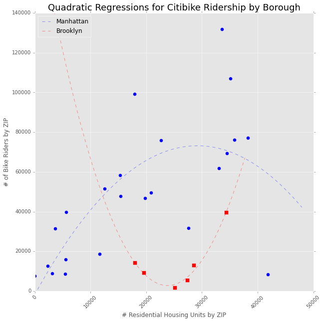

Jonathan Plot Review

Jonathan's graph is very clear and easy to read.  THe axes and data are clearly labelled, and the title is both explicit and not too verbose.  The color schemes are pretty standard, and the information being converyed in the graph is easy to ingest.  The data seemes to scale, truthful, and not distorted.  This is a great chart overall, that shows a lot of information is a thoughtful manner.'