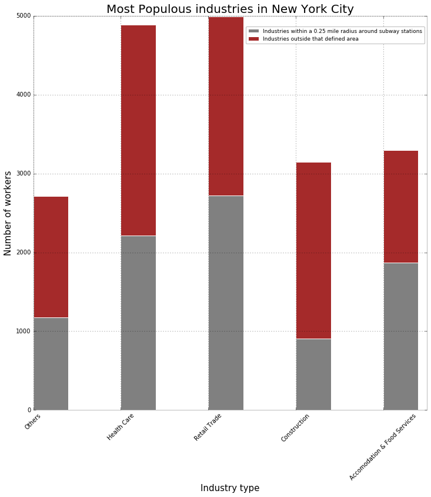

# Manushi Plot Review

Manushi's Graphs is graphically clear and easy to read.  The titles were an appropriate size, and the color scheme was great.  It would be more useful to have a more verbose title, and a more succinct legend (perhaps move the explicit radius distance into the figure title), but graphically it was very straightforward what she was trying to represent, and I ingested the information quickly and efficiently.