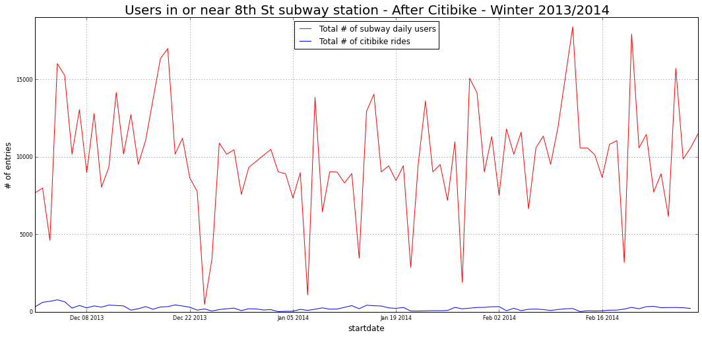

# Soheil Plot Review

Soheil's graph is a little unclear.  First off, i am not sure what "near" means...is this graph a representation of everyone who was walking distance to the subway whether or not they entered it?  How many citibike stations qualified as being "near" the 8th St. Subway station?  The color scheme and labels of the graph are fine, though the fact that the citibike and subway entires are on the same scale makes it hard to read the citibike data.  Perhaps it should be moved to a second axis, unless the pointof the graph is to hilight the large difference in volume.