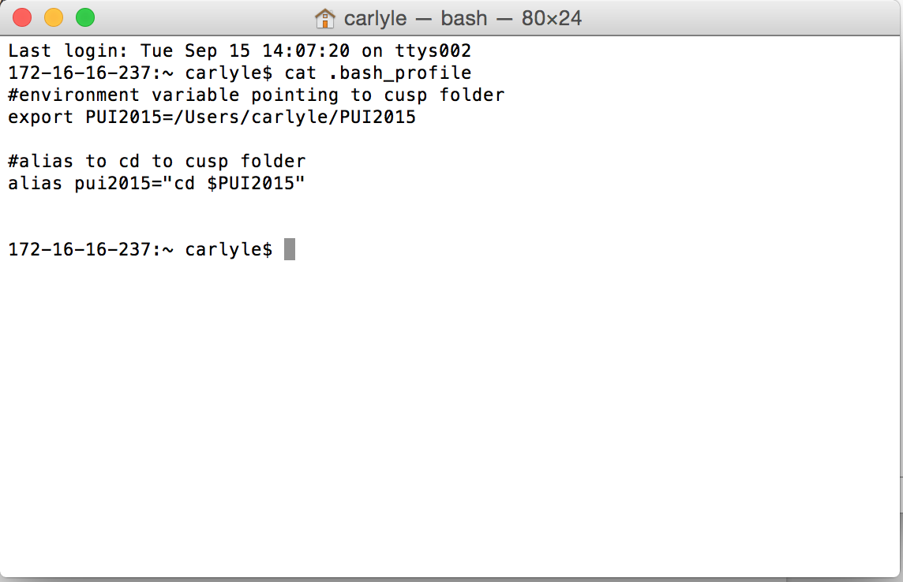
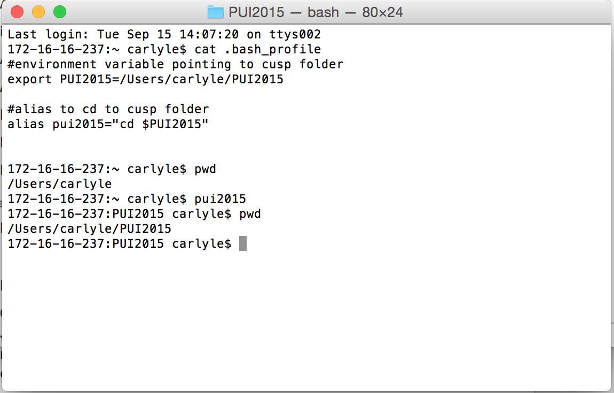

# PUI2015_cdavis

I wrote and created a .bash_profile file on my Mac and edited it to create both an environmental variable pointing to the pathway of the folder for the class, and created an alias (an custom command that is executed by a custom variable) to be able to "cd" into my class folder quicker.  This saves time, keystrokes, and makes code more readable for when I need to reference items in the folder.

